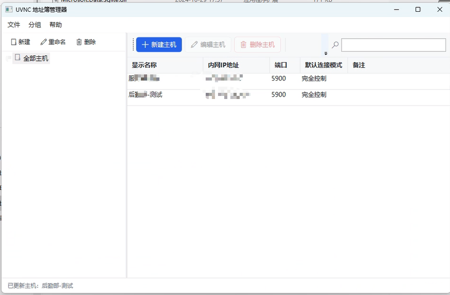

# UVNC Address Book

[](./LICENSE)
[](https://dotnet.microsoft.com/)
[](https://www.microsoft.com/windows)
[](https://learn.microsoft.com/dotnet/desktop/wpf/)

> **Radmin-style phonebook for UltraVNC — LAN-only, zero network, no saved passwords.**
> 一款纯本地、零联网的 Windows 桌面工具，作为 **UltraVNC Viewer** 的外壳管理工具，复刻 Radmin Viewer「主机电话簿」体验：只管理主机列表，不渲染远程桌面画面，仅调用本地 `uvncviewer.exe` 发起 VNC 会话。

Built for internal-network Ops — hospital check-up centers, server rooms, campus PCs — where you need a tidy, grouped host list and one-click connect, with **no cloud, no telemetry, no internet**.

---

## ✨ Features

- **Grouped tree** — multi-level folders (e.g. `Checkup Dept` / `Office PCs` / `Server Room`); create, rename, delete (recursive), and drag-drop hosts between groups.
- **Host management** — add / edit / delete hosts with fields: display name, LAN IP, port, default mode (Full Control / View Only), comment.
- **One-click connect** — double-click = Full Control; right-click menu offers Full Control / View Only / Edit / Delete / Export selected.
- **Temp-config launch** — writes a short-lived `*.vnc` file (IP, port, viewonly flag) to the temp dir, calls `uvncviewer.exe -config`, and deletes it after exit. **Password is never written.**
- **Import / Export** — full or selected hosts to JSON backup; import JSON to restore (great for migrating to a new machine).
- **Settings** — configure `uvncviewer.exe` path; window size/position and DataGrid column widths are remembered.
- **Validation & safety** — IP format + port range (1–65535) + private-network check; friendly prompt when `uvncviewer.exe` is missing.
- **100% local** — all data in a local SQLite file (`uvnc_addressbook.db`, next to the exe). **No HTTP / gRPC / HttpClient, no telemetry, no update checks.**

---

## 📸 Screenshots



> Main window: grouped host tree on the left, searchable host grid on the right. Double-click a host to launch UltraVNC Viewer in Full Control mode.

---

## 🎯 Why this exists

UltraVNC's built-in viewer has no proper "phonebook" for organizing many internal hosts. Radmin Viewer had a great one; this tool reproduces that experience as a **thin shell** — it never touches the remote framebuffer, it just manages your host list and hands off to `uvncviewer.exe`. Perfect for closed LAN environments that must not touch the internet.

---

## 🚀 Quick Start

1. Open **`uvnc-address-book.sln`** in Visual Studio 2022 (or `dotnet build -c Release`).
2. On first build, NuGet restores `Microsoft.Data.Sqlite` **once** (build-time only; runtime is fully offline).
3. Run the app:
   - First launch shows a **"Select uvncviewer.exe"** dialog — point it at your local `uvncviewer.exe` (e.g. `D:\Program Files\uvnc bvba\UltraVNC\uvncviewer.exe`). Saved immediately; editable later in Settings.
   - A `uvnc_addressbook.db` is auto-created next to the exe on first run.
4. Create a group → add a host (e.g. `Phlebotomy-03`, `192.168.1.23`, port `5900`) → double-click to connect.

---

## 🖥️ Usage

| Task | How |
|---|---|
| New / rename / delete group | Left toolbar buttons, or right-click the tree (delete is recursive + confirms) |
| Add / edit / delete host | Top toolbar, or right-click a row (confirm on delete) |
| Re-group a host | Drag a host row onto a target group node |
| Search | Top-right search box filters by name / IP / comment (local only) |
| Connect | Double-click = Full Control; right-click → View Only. Password prompt is shown by UltraVNC itself — **never stored** |
| Backup / migrate | Menu `File → Export All` (JSON); `File → Import` to restore |

---

## 🏗️ Architecture

Clean, single-project WPF (.NET 8). No MVVM framework, no external services — just `Microsoft.Data.Sqlite`.

```
uvnc-address-book/
├── uvnc-address-book.sln        # Solution
├── uvnc-address-book.csproj     # net8.0-windows + UseWPF, only Microsoft.Data.Sqlite
├── App.xaml(.cs)                # Startup + global styles (auto-creates DB on launch)
├── MainWindow.xaml(.cs)         # Group tree + host grid, drag-drop, search, context menus
├── HostEditWindow.xaml(.cs)     # Host add/edit dialog (with validation)
├── SettingsWindow.xaml(.cs)     # uvncviewer.exe path + window-state memory
├── InputBox.xaml(.cs)           # Generic text-input dialog (group name)
├── Db.cs                        # SQLite schema bootstrap + CRUD (Groups / Hosts / Settings)
├── Models.cs                    # Host / GroupNode models
├── VncLauncher.cs               # Temp .vnc config writer + process launcher (no password)
├── ImportExport.cs              # JSON export / import
└── uvnc_addressbook.db          # Auto-generated at runtime (gitignored)
```

**Key invariants (contributors, please keep these):**
- 🚫 No network code anywhere. No `HttpClient`, no sockets, no cloud sync.
- 🔒 VNC passwords are never persisted — the temp `.vnc` file contains **only** host/port/viewonly.
- 🏠 IP validation restricts to private ranges (10/8, 172.16/12, 192.168/16, 169.254/16).

---

## 🛠️ Build & Run (developers)

```bash
# Visual Studio 2022 → open uvnc-address-book.sln → Build Solution
# or CLI (requires .NET 8 SDK):
dotnet build -c Release
dotnet run -c Release
```

- Target framework: `net8.0-windows`
- UI: WPF (`UseWPF`)
- Dependency: `Microsoft.Data.Sqlite` only
- Nothing web / network / cloud related

---

## 🔒 Security & Compliance

- **Zero network** — no requests, telemetry, or update checks. Safe for air-gapped LANs.
- **No persisted passwords** — the VNC password is entered in UltraVNC's own prompt every time.
- **LAN-only** — private-network IP enforcement; no P2P / NAT traversal / cloud sync.
- **Your data stays yours** — everything lives in a local SQLite file; back it up yourself.

---

## 🗺️ Roadmap

Help wanted on these (see [CONTRIBUTING.md](./CONTRIBUTING.md)):

- [ ] Multi-VNC-client support (TightVNC / RealVNC launchers)
- [ ] Bulk host import from CSV
- [ ] Group tree expand/collapse state persistence
- [ ] Optional AES-encrypted connection profiles (still no cloud)
- [ ] Light / Dark theme switch
- [ ] Keyboard shortcuts for connect actions

---

## 🤝 Contributing

Contributions are welcome! Whether it's a bug fix, a translation, or a new feature — please read
**[CONTRIBUTING.md](./CONTRIBUTING.md)** first. Good first issues are labeled `good first issue`.

1. Fork → create a branch (`feat/...`, `fix/...`)
2. Build with VS2022 / `dotnet build`
3. Open a PR with a clear description

---

## 📄 License

[MIT](./LICENSE) © UVNC Address Book contributors.

---

## 🏷️ Suggested GitHub Topics

Add these on the repo's **About** page to maximize discoverability:

`vnc` · `ultravnc` · `remote-desktop` · `wpf` · `dotnet` · `windows` · `lan` · `intranet` · `address-book` · `phonebook` · `sysadmin` · `offline` · `sqlite`
